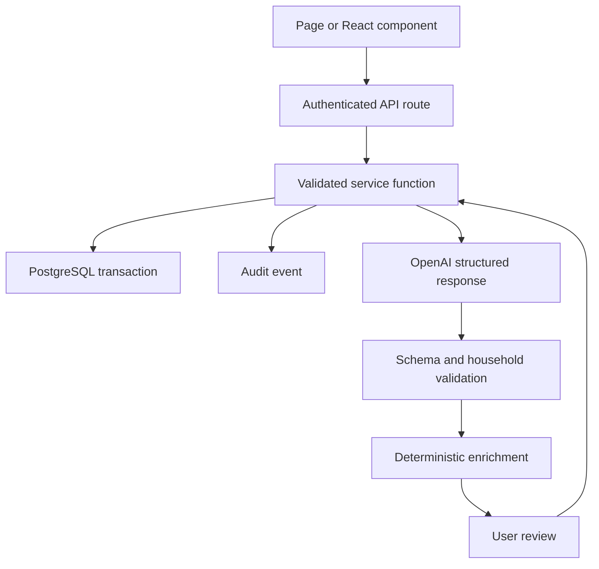
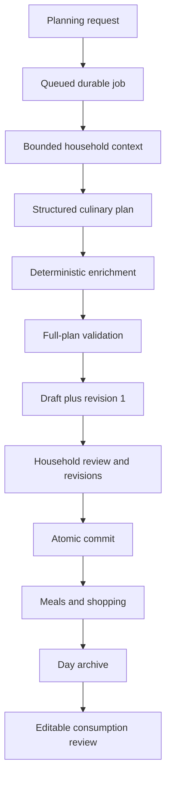

# Kitchen Planner Maintainer Guide

Version covered: 0.6.5.1
Audience: maintainers, future contributors, and coding agents

## 1. Purpose of this guide

This is the practical map of Kitchen Planner: what the application does, how the code is arranged, how data and AI results move through it, which safety rules must not be broken, and how to make changes without repeatedly spending a large amount of Codex context and credits.

The short version is:

- PostgreSQL is the source of truth.
- The browser never writes to PostgreSQL directly.
- API routes authenticate and delegate.
- Service functions validate, transact, and audit.
- AI produces reviewable structured proposals or draft culinary decisions.
- Deterministic application code owns inventory arithmetic, shopping reconciliation, household-ID checks, scoring, persistence, and final mutations.
- Destructive or ambiguous changes require a preview and explicit confirmation.
- Released migrations are append-only.
- Release ZIPs are deployment artifacts, not a good development source of truth.

## 2. The most important workflow change

Kitchen Planner should have one canonical Git repository. Version 0.6.4.7 is the sanitized recovery baseline intended for the initial remote commit and tag. Future ZIP files should be built from tagged commits.

The current ZIP-snapshot workflow has repeatedly required an older source tree to be discarded and the newest ZIP to be recovered before a patch could begin. That creates three forms of waste:

1. Codex has to rediscover the same architecture.
2. A previous fix can be accidentally omitted when work starts from an old snapshot.
3. The full suite and release package must be revalidated merely to re-establish a trustworthy base.

A canonical repository makes the current state self-evident:

```text
main
  └── tag v0.6.4.7
        └── branch fix/example-problem
              └── reviewed commit
                    └── next release tag
                          └── release ZIP
```

The Unraid database, uploads, `.env`, and backups must not be committed. Only application source, migrations, tests, documentation, and safe configuration examples belong in Git.

## 3. Do not organize work as “one file at a time”

Use one **behavioural outcome** at a time.

A safe change often must touch more than one file:

- a UI component;
- an API route or server action;
- a Zod input/output contract;
- a service function;
- a regression test;
- sometimes an append-only migration.

Artificially stopping after one file can leave the system inconsistent. For example, changing a meal-plan field only in the UI would not update the Structured Output schema, deterministic validator, persisted JSON, or tests.

The better rule is:

> One coherent behaviour per branch/chat, normally with a declared budget of two to six source files plus the smallest relevant tests.

Examples:

| Good unit of work                                                                               | Poor unit of work                      |
| ----------------------------------------------------------------------------------------------- | -------------------------------------- |
| “When Greek yogurt is recorded in kg, satisfy requirements in g and add only a real remainder.” | “Edit `weekly-shopping.ts`.”           |
| “Archive all expired flyers in one confirmed, audited action.”                                  | “Work on the flyer page.”              |
| “Show the same release version in Settings, Compose, and the installer.”                        | “Change all version strings you find.” |
| “A truncated refinement retries once with a compact contract and retains diagnostics.”          | “Improve AI reliability.”              |

For a very small presentation-only change, one file may genuinely be enough. Let the behaviour determine that naturally.

## 4. Product and safety invariants

These are more important than any individual implementation detail.

1. **PostgreSQL is canonical.** The workbook is historical/import input after cutover, not a live second database.
2. **Every record is household-scoped.** Never query or mutate an owned record by ID without `household_id`.
3. **Person-specific data stays person-specific.** A member’s work-lunch restriction must not become a household dinner prohibition.
4. **All mutations are validated.** Parse external input before using it.
5. **All meaningful mutations are audited.** Preserve before/after state and the acting user/source.
6. **Multi-record operations are atomic.** Planning commits, grocery registration, cutover, and review application use transactions.
7. **AI cannot run SQL or directly mutate household data.**
8. **AI output is untrusted.** Validate structure, IDs, ownership, dates, quantities, URLs, and domain rules after generation.
9. **The server owns arithmetic and reconciliation.** Do not accept model-authored stock allocation or shopping as truth.
10. **Unknown quantity is not zero and is not known stock.** Preserve uncertainty explicitly.
11. **Ambiguous container conversions are not guessed.** “1 jar” cannot safely prove “6 tbsp”; show a confirmation warning.
12. **Destructive or ambiguous actions require review.**
13. **History is preserved.** Archive or supersede records instead of silently deleting them.
14. **Released SQL migrations are immutable.** Add a new numbered migration; never edit an applied migration.
15. **The OpenAI key remains server-side.**
16. **The application remains LAN-only unless the owner explicitly changes that requirement.**

These invariants belong in the short root `AGENTS.md`. Detailed explanations belong here so they are not injected into every Codex turn.

## 5. Technology stack

| Layer                | Technology                      | Role                                                                |
| -------------------- | ------------------------------- | ------------------------------------------------------------------- |
| Web application      | Next.js 16 App Router           | Pages, server-rendered data, API routes                             |
| UI                   | React 19 + TypeScript           | Interactive managers and review flows                               |
| Validation           | Zod 4                           | HTTP input, AI contracts, stored payload validation                 |
| Database             | PostgreSQL 17                   | Canonical household and operational data                            |
| Database definitions | Drizzle ORM schema declarations | Typed table definitions; much service SQL is intentionally explicit |
| Database tests       | PGlite                          | Fast PostgreSQL-compatible integration tests                        |
| AI                   | OpenAI Responses API            | Structured proposals, planning, extraction, and recipe evidence     |
| Testing              | Vitest                          | Unit and integration regression suite                               |
| Deployment           | Docker + `unraid.sh`            | Unraid build, migrate, start, backup, restore, health checks        |
| Runtime              | Node.js 22                      | Next.js server and maintenance scripts                              |

## 6. Runtime architecture



The normal non-AI mutation path is:

1. A server-rendered page loads household-scoped records.
2. A client component sends JSON to `/api/v1/...`.
3. The route obtains the current household session.
4. The route passes the body and stable IDs to a service.
5. The service parses the input with Zod.
6. The service checks ownership and related-record validity.
7. The service opens a transaction when multiple changes are possible.
8. The service changes domain data and appends an audit event.
9. The API returns a safe result.
10. The client refreshes or updates its review state.

API route files are deliberately thin. Business rules should not accumulate in them.

## 7. Source-tree map

| Path                                  | Responsibility                                                                          |
| ------------------------------------- | --------------------------------------------------------------------------------------- |
| `app/`                                | Pages, layouts, metadata, and HTTP route handlers                                       |
| `app/api/auth/`                       | Login/logout endpoints                                                                  |
| `app/api/v1/`                         | Authenticated JSON API                                                                  |
| `components/`                         | Client-side forms, managers, review cards, and interactive controls                     |
| `lib/auth/`                           | PIN verification, opaque sessions, and page/API session retrieval                       |
| `lib/db/schema.ts`                    | Database table and enum definitions                                                     |
| `lib/db/queries.ts`                   | Read-oriented household queries and page projections                                    |
| `lib/services/`                       | Domain mutations and orchestration                                                      |
| `lib/validation.ts`                   | Ordinary non-AI request schemas                                                         |
| `lib/ai/contracts.ts`                 | AI request/response and weekly-plan schemas                                             |
| `lib/ai/context.ts`                   | Bounded, relevant household context retrieval and sale ranking                          |
| `lib/ai/provider.ts`                  | Responses API call, Structured Output parsing, timeouts, evidence, and usage accounting |
| `lib/ai/inventory-meal-capability.ts` | Conservative prepared-food classification                                               |
| `drizzle/`                            | Ordered, append-only production SQL migrations                                          |
| `scripts/`                            | Migration, seed, smoke, health, cutover, and dependency checks                          |
| `tests/`                              | Behavioural regression suite                                                            |
| `docs/`                               | Architecture, workflows, migration, deployment, and this maintainer guide               |
| `unraid.sh`                           | Host-side install, update, backup, restore, logs, health, and cleanup                   |
| `compose.yml`                         | Optional Compose topology; `unraid.sh` remains the normal Unraid path                   |
| `Dockerfile`                          | Multi-stage production build and standalone runtime                                     |

## 8. Pages, components, and routes

The main page/component pairs are:

| User area | Page                     | Main component                                                              |
| --------- | ------------------------ | --------------------------------------------------------------------------- |
| Inventory | `app/inventory/page.tsx` | `components/inventory-manager.tsx`                                          |
| Shopping  | `app/shopping/page.tsx`  | `components/shopping-manager.tsx`                                           |
| Meal Plan | `app/meal-plan/page.tsx` | `weekly-planner.tsx`, `meal-plan-manager.tsx`, `weekly-plan-refinement.tsx` |
| Recipes   | `app/recipes/page.tsx`   | `components/recipe-manager.tsx`                                             |
| Flyers    | `app/flyers/page.tsx`    | `components/flyer-manager.tsx`                                              |
| Feedback  | `app/feedback/page.tsx`  | `feedback-manager.tsx`, `feedback-learning.tsx`                             |
| Settings  | `app/settings/page.tsx`  | timezone, source, import, audit, and usage components                       |
| Assistant | `app/assistant/page.tsx` | quick update and AI proposal components                                     |

Most route handlers follow this pattern:

```ts
const actor = await getCurrentSession();
if (!actor) return NextResponse.json({ error: "Authentication required" }, { status: 401 });

try {
  return NextResponse.json(await domainService(actor, await request.json()));
} catch (error) {
  return apiError(error);
}
```

When adding a route:

- authenticate first;
- parse path IDs with `idSchema`;
- delegate domain logic;
- use the shared error conversion;
- do not duplicate service rules in the route.

## 9. Database model

All primary domain tables carry `household_id`. The most important groups are:

### Household and access

- `households`
- `household_users`
- `app_sessions`
- `app_settings`

### Kitchen state

- `storage_locations`
- `inventory_entries`
- `shopping_items`
- `staple_targets`

### Planning and learning

- `recipes`
- `food_preferences`
- `meal_plan_entries`
- `meal_day_inventory_reviews`
- `unscheduled_items`
- `meal_feedback`

### Flyers

- `flyer_sources`
- `flyer_sale_items`

### AI and weekly-plan history

- `ai_jobs`
- `ai_runs`
- `ai_proposals`
- `weekly_plans`
- `weekly_plan_revisions`
- `weekly_plan_recipe_sources`
- `weekly_plan_suggestions`

### Import and audit

- `audit_events`
- `import_batches`
- `import_rows`
- `cutover_runs`

For column-level details, read `lib/db/schema.ts`. For the semantic summary and retention rules, read `docs/DATA_MODEL.md`.

## 10. Validation layers

Kitchen Planner intentionally validates at several boundaries:

1. **HTTP validation**  
   `lib/validation.ts` and input schemas in `lib/ai/contracts.ts`.

2. **Structured Output validation**  
   `lib/ai/provider.ts` requests a strict schema and reports refusal, truncation, or incomplete JSON clearly.

3. **Post-generation household validation**  
   IDs, dates, owners, recipes, flyer sales, meal assignments, leftovers, and constraints are checked against the exact supplied context.

4. **Deterministic enrichment**  
   Saved-recipe expansion, unit conversion, inventory allocation, shopping, warnings, and scorecards are rebuilt locally.

5. **Database validation**  
   Foreign keys, checks, unique constraints, and transactional locking protect persistence.

6. **Commit-time revalidation**  
   A reviewed draft is checked again because inventory, shopping, or calendar state may have changed since generation.

Never remove a later validation layer merely because an earlier layer appears to cover the same rule. They protect against different failure modes and different times.

## 11. Ordinary service layer

`lib/services/mutations.ts` currently contains many day-to-day domain operations:

- create/update/consume/archive inventory;
- bulk inventory actions;
- create/update/remove shopping;
- register a grocery trip;
- create and resolve meal-day inventory reviews;
- create/update/delete meals;
- automatic day archival and committed-plan retirement;
- create/update/schedule Unscheduled items;
- import-row decisions;
- timezone changes;
- feedback operations.

Every mutation should:

- parse input;
- verify household ownership;
- use a transaction when more than one row can change;
- record an audit event;
- preserve existing data on partial/status-only updates;
- return only the data the UI needs.

`mutations.ts` is now a maintenance hotspot. It should eventually be split by domain, but that split should be a dedicated no-behaviour-change project with regression tests, not mixed into a feature patch.

Suggested future modules:

```text
lib/services/inventory.ts
lib/services/shopping.ts
lib/services/meals.ts
lib/services/meal-inventory-reviews.ts
lib/services/unscheduled.ts
lib/services/feedback.ts
lib/services/import-decisions.ts
```

## 12. AI architecture

The application uses AI for bounded interpretation and culinary decisions. It does not use AI as a database.

### Model routing

| Tier     | Default model   | Typical work                                                             |
| -------- | --------------- | ------------------------------------------------------------------------ |
| Economy  | `gpt-5.4-mini`  | English normalization, simple updates, small grocery batches             |
| Primary  | `gpt-5.4`       | Nuanced updates, feedback, flyer/recipe extraction, targeted refinements |
| Balanced | `gpt-5.6-terra` | Default complete weekly plan; advanced targeted work                     |
| Deep     | `gpt-5.6-sol`   | Explicit opt-in weekly planning only                                     |

Environment variables select aliases so models can change without a migration. The model names shown here describe the 0.6.4.5 baseline; current official model guidance should be checked before a future model migration.

### Provider boundary

`lib/ai/provider.ts` owns:

- OpenAI client construction;
- household-scoped safety identifier;
- selected model and reasoning effort;
- request timeout and cancellation;
- `store: false`;
- strict Structured Output conversion;
- web-search source extraction;
- token usage and estimated cost;
- refusal, timeout, and incomplete-response errors.

Other services should call `runStructured`; they should not instantiate their own OpenAI client.

### Context boundary

`lib/ai/context.ts` loads broad household records locally, scores relevance, then supplies bounded subsets to the model.

The goal is not “send everything.” The goal is “send every fact that can change this decision, under explicit caps.”

Important current context includes:

- active inventory;
- flavour assets;
- active household members;
- person/household preferences;
- recent feedback;
- eight weeks of meal history;
- existing meals in the planning window;
- Unscheduled intentions;
- active shopping;
- ranked recipes;
- ranked accepted sales.

### Proposal boundary

Routine AI workflows create `ai_jobs`, `ai_runs`, and reviewable `ai_proposals`. The proposal can be approved in whole or in selected parts. Rejection changes no kitchen state.

### Diagnostics boundary

Every AI run should retain:

- workflow and prompt version;
- model and tier;
- reasoning effort;
- response ID;
- input, cached input, output, and total tokens;
- estimated token cost;
- latency;
- web-search calls/source count;
- error details.

An incomplete result still consumed tokens. Preserve its diagnostics rather than treating it as a zero-cost non-event.

## 13. Weekly planning lifecycle



### 13.1 Queue

`POST /api/v1/weekly-plans` validates the request, creates a durable queued job, returns HTTP 202, and schedules processing. The browser polls the job route.

Only one queued/running full-plan generation is allowed per household.

### 13.2 Normalize

Free-text planning notes receive a small English-normalization call. The original and normalized statements are retained. This keeps multilingual input faithful while matching and proposal fields remain consistent.

### 13.3 Load context

`planningContext` loads and caps the relevant household snapshot. Accepted active sales are ranked before their cap is applied.

### 13.4 Generate model-owned fields

The model chooses:

- meals and assignments;
- preparation basis;
- technique and primary ingredients;
- complete ingredient requirements;
- concise preparation method where needed;
- saved/verified recipe use;
- leftover relationships;
- sale anchors;
- prep tasks;
- culinary warnings.

The generation schema intentionally does **not** let the model own:

- inventory allocation;
- shopping lines;
- scorecard;
- plan-format version.

### 13.5 Deterministic enrichment

The server:

- expands saved recipe ingredients;
- resolves valid recipe and sale IDs;
- converts compatible units;
- allocates inventory;
- detects shortages;
- merges existing shopping coverage;
- produces automatic shopping lines;
- honors persisted `shoppingDecisions` before rebuilding automatic requirements;
- retains sale/store/price provenance;
- bounds and prioritizes warnings;
- builds the review scorecard.

Automatic shopping rows are projections, so deleting a row alone used to lose the user's intent when `reconcileWeeklyPlanShopping` rebuilt it. `lib/services/weekly-planning.ts` now converts a removed automatic row into a persisted draft decision, while `lib/services/weekly-shopping.ts` applies explicit exclusion or inventory-association decisions before recreating shortages. The selected inventory record is stored in the weekly-plan JSON payload only; no inventory quantity is changed and no database migration is required.

### 13.6 Validate

`validateWeeklyPlan` checks coverage, overlap, constraints, preparation completeness, leftovers, inventory, shopping, recipes, sales, and conflicts. A completely empty requested slot remains blocking; a slot that has a meal but omits one active member is a warning. Duplicate prep-task IDs produce at most one finding per duplicated ID.

Errors block commit. Warnings remain reviewable.

### 13.7 Revise

Every meaningful edit appends an immutable `weekly_plan_revisions` row. Restoring a previous revision creates a new revision; it never erases intervening history.

Targeted refinement in `lib/services/weekly-refinement.ts` removes the selected meals' links from shopping rows, shopping decisions and prep tasks before replacement records are merged. `normalizeWeeklyPlanMealLinkedRecords` then canonicalizes valid leftover bases, merges or safely renames duplicate prep IDs, and preserves unrelated links. Structured leftover IDs—not display titles—govern source relationships.

### 13.8 Commit

Commit revalidates and writes meals, expected inventory uses, prep tasks, recipe provenance, and nonduplicate shopping in one transaction. Replacing an existing planned meal requires a separate explicit approval.

### 13.9 Complete and archive

When no Planned meal remains on a date:

- deferred items return to Unscheduled;
- the day archives;
- expected inventory use becomes an editable review;
- no inventory is subtracted until the household applies it;
- after the final linked day archives, the committed plan leaves the normal Planner list while history remains.

## 14. Shopping and inventory reconciliation

This is one of the most important deterministic subsystems.

`lib/services/weekly-shopping.ts` should remain the authority for:

- normalized ingredient-name matching;
- safe mass conversions (`kg`/`g`, `lb`/`oz`);
- safe volume conversions (`L`/`ml`);
- safe count conversions (`dozen`/`each`);
- available inventory;
- active shopping coverage;
- exact remaining shortfall;
- package rounding for countable shortages;
- container ambiguity;
- allocation back into the inventory item’s native unit.

Examples:

| Inventory              | Requirement | Correct result                                                 |
| ---------------------- | ----------- | -------------------------------------------------------------- |
| 1.5 kg Greek yogurt    | 750 g       | Covered; record use in the inventory’s native unit             |
| 1.5 kg Greek yogurt    | 2 kg        | Add only 500 g                                                 |
| 1 jar tahini           | 2 tbsp      | Do not claim zero; ask the household to confirm enough remains |
| Unknown amount of rice | 500 g       | Do not count as measured stock                                 |

AI may decide that a meal needs tahini. It must not decide how much recorded tahini exists.

## 15. Targeted refinements, alternatives, and recipe repair

`lib/services/weekly-refinement.ts` owns:

- replacing one meal, one person’s meal, or a full day;
- preserving protected IDs, dates, meal types, and assignments;
- generating three alternatives;
- finding exact recipe links;
- checking an existing recipe source;
- applying a selected suggestion;
- attaching deterministic shopping;
- appending immutable revisions.

The 0.6.4.5 recovery rule is:

1. Use the compact generation-only schema.
2. Start with the normal targeted ceiling.
3. Retry exactly once only for a genuine `max_output_tokens` truncation.
4. Add the compact-recovery instruction.
5. Use the larger recovery ceiling.
6. Retain the first failed run and its response ID/token usage.
7. Modify the draft only from a complete validated response.

Do not turn every provider error into an automatic retry. Refusals, invalid household references, network/auth errors, and domain validation failures need different handling.

## 16. Flyers and recipes

### Flyer lifecycle

1. Add source metadata and optional file/URL.
2. AI extracts proposed rows, or the household enters rows manually.
3. Review every row.
4. Accept, correct, or reject it.
5. Commit the flyer only after no proposal remains and at least one row is accepted.
6. Only accepted rows from active, overlapping flyers enter planning.
7. Prioritization is a household decision.
8. Expired flyers can be archived in bulk without deleting evidence.

Multi-buy comparison must use the same price basis:

```text
2 for $6.00 = $3.00 each
regular $3.99 each
```

Comparing `$6.00` directly to `$3.99` is invalid. The AI contract, application validation, and PostgreSQL constraint must agree.

### Recipe lifecycle

Recipes can be entered manually or imported from text, a URL, image, or PDF. AI import returns an editable draft. It never saves automatically.

Saved recipes can be:

- preferred or avoided;
- favourite/proven/experimental;
- scheduled through Unscheduled;
- attached to a draft;
- expanded into complete requirements during reconciliation.

Exact public recipe links are evidence, not truth by themselves. Canonicalize URLs, enforce blocked domains, and retain verification state separately from user-entered links.

## 17. Authentication and privacy

- Household users authenticate with PINs.
- PINs are scrypt-hashed.
- Browser sessions use opaque tokens; only token hashes are stored.
- `getCurrentSession` scopes API work.
- `requirePageSession` protects server-rendered pages.
- OpenAI receives a one-way household safety identifier, not the PostgreSQL household UUID.
- `OPENAI_API_KEY` stays in `.env` on the server.
- The Responses API is called with storage disabled.
- The app stores its own submitted text, drafts, proposals, diagnostics, and token accounting in PostgreSQL.

Do not log secrets, raw session tokens, passwords, database dumps, or `.env`.

## 18. Deployment and operations

The normal Unraid source directory is:

```text
/mnt/user/appdata/kitchen-planner/source
```

Persistent data lives outside the source tree:

```text
/mnt/user/appdata/kitchen-planner/postgres
/mnt/user/appdata/kitchen-planner/uploads
/mnt/user/appdata/kitchen-planner/backups
```

`unraid.sh update`:

1. creates a database backup if the database container exists;
2. validates/migrates release configuration;
3. stamps `APP_VERSION`;
4. builds a new application image;
5. recreates the containers;
6. waits for PostgreSQL and application health;
7. retains the old image if the replacement is unhealthy;
8. removes only the superseded Kitchen Planner image after success;
9. prunes unused build cache older than 24 hours.

The Docker image starts by:

1. running append-only migrations;
2. running guarded seed logic;
3. starting the standalone Next.js server.

Useful commands:

```bash
./unraid.sh backup
./unraid.sh update
./unraid.sh status
./unraid.sh logs app
./unraid.sh logs db
./unraid.sh cleanup
```

Never replace the safe cleanup with a broad `docker system prune -a --volumes`.

## 19. Migration rules

Migration filenames are ordered:

```text
0000_initial.sql
...
0016_multibuy_flyer_price_integrity.sql
0017_next_change.sql
```

The migration runner stores each filename and SHA-256 checksum. If an already-applied file changes, startup fails deliberately.

For a schema change:

1. update `lib/db/schema.ts`;
2. add the next SQL file;
3. preserve old data or backfill explicitly;
4. update `tests/migrations.test.ts`;
5. add a domain regression test;
6. document whether the migration is automatic and reversible;
7. never rewrite an applied migration.

## 20. Test map

| Change area                           | Start with                                                            |
| ------------------------------------- | --------------------------------------------------------------------- |
| Inventory CRUD/consumption            | `inventory-actions`, `inventory-consume`, `inventory-bulk-validation` |
| Shopping/grocery registration         | `meal-shopping-workflows`, `settings-shopping-controls`               |
| Weekly generation/commit              | `weekly-planning`                                                     |
| Refinements/alternatives/recipe links | `weekly-refinement`                                                   |
| AI schemas                            | `ai-contracts`                                                        |
| Context caps and sale ranking         | `ai-context-budget`, `recipe-flyer-planning`                          |
| Model routing/retry                   | `ai-fallback-routing`, `ai-provider-timeout`                          |
| Usage reporting                       | `ai-usage-summary`                                                    |
| Recipes/flyers                        | `recipe-flyer-planning`, `ai-attachments`, `upload-limits`            |
| Day archive/inventory review          | `meal-shopping-workflows`                                             |
| Database changes                      | `migrations`                                                          |
| Authentication                        | `phase3`                                                              |
| Workbook import/cutover               | `workbook-preview`, `phase4-cutover`                                  |
| Unraid behavior                       | `unraid-storage-guard`                                                |
| Version consistency                   | `release-version`                                                     |

### Validation ladder

Do not run the most expensive validation after every small edit.

**During implementation**

```bash
npx vitest run tests/the-relevant-test.test.ts
```

**After the behaviour works**

```bash
npm run format:check
npm run typecheck
npx vitest run tests/relevant-one.test.ts tests/related-one.test.ts
```

**Before a normal handoff**

```bash
npm run format:check
npm run test:run
npm run typecheck
```

**Before a release ZIP**

```bash
npm run format:check
npm run test:run
npm run typecheck
npm run build
npm run verify:runner
npm run verify:runtime
bash -n unraid.sh
```

Then inspect the ZIP, confirm `.env`, dependencies, `.next`, runtime data, and caches are excluded, test ZIP integrity, and generate the checksum.

This staged approach saves time and Codex usage while preserving full release confidence.

## 21. Release-version checklist

0.6.4.5 added `tests/release-version.test.ts`, which keeps these aligned:

- `package.json`;
- `package-lock.json`;
- `lib/config.ts` Settings default;
- `compose.yml`;
- `unraid.sh`.

A release should also update human-facing documentation:

- `.env.example`;
- `README.md`;
- `docs/AI_WORKFLOWS.md` when AI behavior changed;
- `docs/UNRAID_7_1_2.md` install/upgrade instructions;
- this guide if architecture or maintenance rules changed.

Recommended release sequence:

1. Choose the patch/minor version.
2. Update package and lock versions.
3. Update version defaults and installer.
4. Update release notes and affected docs.
5. Run `tests/release-version.test.ts`.
6. Run `npm run format:check`.
7. Run the full release validation.
8. Commit.
9. Tag the exact commit.
10. Build the source-only ZIP from that tag.
11. Generate and verify SHA-256.

## 22. Current maintenance hotspots

The following files have accumulated several responsibilities:

| File                               | Approximate size in 0.6.4.5 | Why it is costly                                                    |
| ---------------------------------- | --------------------------: | ------------------------------------------------------------------- |
| `lib/services/weekly-planning.ts`  |                       69 KB | Job lifecycle, prompts, generation, validation, persistence, commit |
| `lib/services/mutations.ts`        |                       46 KB | Many unrelated day-to-day domains                                   |
| `components/weekly-planner.tsx`    |                       38 KB | Job UI, form state, polling, plan review                            |
| `lib/ai/contracts.ts`              |                       30 KB | Contracts for every AI workflow                                     |
| `lib/services/weekly-shopping.ts`  |                       25 KB | Matching, conversion, allocation, shopping                          |
| `components/inventory-manager.tsx` |                       25 KB | Forms, filtering, bulk actions, display                             |
| `components/shopping-manager.tsx`  |                       21 KB | Shopping, registration, AI recommendations                          |
| `app/globals.css`                  |                       57 KB | Styling for the entire application                                  |

This does not mean they should all be split immediately. It means a request touching one of them should name the relevant functions and tests so Codex does not need to load the whole subsystem repeatedly.

Suggested gradual refactors:

1. Format source consistently with Prettier.
2. Move AI prompts to `lib/ai/prompts/` by workflow.
3. Split AI contracts by workflow while retaining a compatibility index.
4. Split `mutations.ts` by domain.
5. Split weekly job lifecycle from culinary validation/commit orchestration.
6. Split large client managers into form, table, and modal components.
7. Split global CSS by page/component only if the build approach remains simple.

Each refactor should be behaviour-preserving, independently reviewed, and committed before a feature change.

## 23. Efficient Codex workflow for this project

### Step 1: Keep one durable project

Open the canonical repository as the local project. Keep the root `AGENTS.md` short and accurate. Store detailed architecture here.

### Step 2: Start a new chat for each coherent outcome

Do not use one chat for the entire Kitchen Planner roadmap. Good chat boundaries are:

- one bug;
- one feature;
- one architecture decision;
- one release;
- one documentation/refactor task.

Stay in the same chat through diagnosis, implementation, and validation of that outcome.

### Step 3: Plan before editing

For nontrivial changes, ask first for:

- likely cause;
- affected data flow;
- exact files expected to change;
- migration impact;
- tests to add/run;
- risks and non-goals.

Approve the plan, then implement. This avoids an expensive implementation based on a misunderstood requirement.

### Step 4: Provide a change brief, not the project history

Use the template in section 27. Codex can read this guide, `AGENTS.md`, the current source, and Git history. Repeating months of prior conversation consumes context and can conflict with the current code.

### Step 5: Name relevant evidence

For a bug, provide:

- exact user action;
- expected result;
- actual result;
- exact error;
- app version shown in Settings;
- whether it is reproducible;
- one or two representative records with secrets removed;
- relevant response ID for AI failures.

Avoid pasting hundreds of log lines. Start with the exact error and the surrounding 20–50 lines.

### Step 6: Use the least expensive capable model

For Codex development work:

- use a lightweight model for documentation, formatting, mechanical renames, test fixture updates, and obvious one-file UI changes;
- use an everyday balanced model for normal implementation and bounded debugging;
- reserve the deepest model for ambiguous cross-cutting architecture, data migrations, concurrency, and difficult failures.

The model used by Kitchen Planner’s own OpenAI API calls is a separate choice and a separate budget.

### Step 7: Validate progressively

Run one targeted test while iterating. Run the full suite once the implementation is stable. Build/package only when the release is ready.

### Step 8: Review the diff

Before packaging, ask:

- Did this change only what the brief requested?
- Was any safety boundary weakened?
- Did any unrelated formatter churn enter the patch?
- Did a released migration change?
- Are IDs and household scopes preserved?
- Are model-owned and server-owned fields still separated?
- Does a regression test reproduce the original failure?
- Are version and documentation changes complete?

### Step 9: Commit and tag

Once validated, commit the coherent change. Do not leave the only trustworthy state in a chat workspace or ZIP.

## 24. Two separate usage budgets

It is essential to distinguish:

### Codex/ChatGPT development usage

This is the usage consumed while Codex reads the Kitchen Planner code, edits it, runs tools, and reasons through changes. ChatGPT Work and Codex share the same plan limits. Plus includes a finite allowance rather than unlimited development. Long chats, large context, deep reasoning, repeated repository scans, tool output, and premium models use it faster.

### Kitchen Planner API usage

The `OPENAI_API_KEY` in Kitchen Planner is an API project key. Calls made by the deployed application are billed/limited through that API project. ChatGPT Plus does not make those API calls free.

The Settings page’s AI usage panel estimates Kitchen Planner API token cost. It does not report the Codex credits used to develop the application.

## 25. What actually saves credits

High-impact savings:

1. Canonical Git source instead of ZIP recovery.
2. New chat per coherent outcome instead of one enormous project chat.
3. Short root `AGENTS.md`; detailed docs referenced only when relevant.
4. Specific change briefs.
5. Smallest capable model.
6. Targeted tests during iteration.
7. One full validation/package pass per completed release.
8. Relevant files only, named by the change map.
9. Compact error/log evidence.
10. Deterministic scripts for release packaging and version checks.
11. Regular source formatting and smaller modules.
12. Stop asking the model to regenerate information already stored in code/docs.

Low-impact or counterproductive “savings”:

- forcing one file per task;
- skipping regression tests;
- omitting the error or acceptance criteria;
- asking for implementation before deciding the desired behavior;
- using one long chat because it “already knows everything”;
- repeatedly uploading full ZIPs when a Git diff/branch is available;
- packaging every intermediate attempt.

## 26. Change-to-file map

Use this as the initial inspection scope, not an absolute rule.

| Requested change                 | Inspect first                                                                         | Likely tests                                     |
| -------------------------------- | ------------------------------------------------------------------------------------- | ------------------------------------------------ |
| Inventory form/filter/bulk UX    | `inventory-manager.tsx`, inventory routes, `mutations.ts`, `validation.ts`            | inventory tests                                  |
| Shopping or grocery registration | `shopping-manager.tsx`, shopping routes, `mutations.ts`, AI grocery contract/context  | meal-shopping, AI contract tests                 |
| New meal status/archive behavior | `meal-plan-manager.tsx`, meal routes, `mutations.ts`                                  | meal-shopping workflows                          |
| Full-plan culinary quality       | weekly planning prompt, planning context, generation contract                         | weekly-planning, recipe-flyer-planning           |
| Shopping generated from plans    | `weekly-shopping.ts`, weekly validator/commit                                         | weekly-planning, weekly-refinement               |
| Refine/alternatives/recipe links | `weekly-refinement.ts`, refinement components/contracts                               | weekly-refinement                                |
| Flyer extraction                 | `flyers.ts`, flyer contract, flyer manager, migration only if persisted fields change | recipe-flyer-planning, AI contracts              |
| Recipe import/library            | `recipes.ts`, recipe contract, recipe manager                                         | recipe/flyer and attachment tests                |
| AI truncation/timeout/usage      | `provider.ts`, calling service, AI run persistence                                    | provider-timeout, usage, workflow-specific tests |
| Prompt context size              | `context.ts`, workflow input construction                                             | context-budget and workflow tests                |
| New persisted field              | DB schema, new migration, contract/service/UI                                         | migrations plus domain regression                |
| Settings/version                 | `config.ts`, Settings page, installer, Compose, package metadata                      | release-version                                  |
| Deployment                       | `unraid.sh`, Dockerfile, Compose, scripts                                             | storage guard, runtime checks                    |

## 27. Prompt templates

### Feature or bug implementation

```text
Kitchen Planner change: <short title>

Goal:
<one behavioural outcome>

Current behaviour:
<what happens now>

Expected behaviour:
<what should happen>

Reproduction/example:
<small exact example>

Constraints:
- Preserve household scoping and audit history.
- AI must not own deterministic inventory/shopping arithmetic.
- Do not alter released migrations.
- No unrelated refactor.

Done when:
- <acceptance criterion 1>
- <acceptance criterion 2>
- A regression test reproduces the original problem and passes.

First inspect the maintainer guide and the smallest relevant files. Before
editing, tell me the likely cause, proposed file list, migration impact, and
targeted tests. Implement only after that plan is clear. Run targeted tests
during development; run the full release suite only after the change is stable.
```

### Diagnosis only

```text
Diagnose this Kitchen Planner problem; do not implement yet.

Version:
<Settings version>

Action:
<what I clicked/submitted>

Expected:
<expected result>

Actual:
<actual result>

Exact error/response ID:
<error>

Please identify the failing layer, show the evidence in the current code, list
the smallest safe fixes, and estimate which files/tests each option would
touch. Do not run the complete test suite or package a release.
```

### Small UI-only change

```text
Make this presentation-only change: <change>.

Do not alter API contracts, database behavior, migrations, or AI prompts.
Inspect only the page/component and directly related styles first. Run
typecheck and the smallest relevant test; do not package a release.
```

### Release request

```text
Prepare Kitchen Planner <version> from the current validated Git commit.

Update every release-version surface and affected documentation. Run the full
release validation exactly once after targeted checks are green. Build a
source-only ZIP, exclude secrets/runtime/dependencies/build cache, verify ZIP
integrity, generate SHA-256, and report migrations or .env changes explicitly.
```

## 28. Suggested development foundation project

Before the next substantial feature, do one non-feature maintenance task:

1. Recover the exact verified 0.6.4.5 source.
2. Initialize a private Git repository.
3. Add a safe `.gitignore`.
4. Commit and tag the unmodified baseline as `v0.6.4.5`.
5. Add this guide.
6. Update stale 0.6.4.4 documentation/version examples to 0.6.4.5.
7. Add Prettier and format source in a separate mechanical commit.
8. Add format checking to validation.
9. Confirm all 98 tests and the production build still pass.
10. Tag/document the maintenance result or keep it as the clean base for the next release.

Do not combine the formatter commit with a behaviour change. A mechanical diff should remain mechanically reviewable.

After that, consider splitting the largest modules one at a time, again without changing behavior.

## 29. Recommended operating cadence

For each idea:

1. Discuss/decide the product behaviour in Chat.
2. Write a five-to-fifteen-line change brief.
3. Start a new Codex chat in the same Kitchen Planner project.
4. Ask for a scoped plan and likely file list.
5. Implement one behavioural outcome.
6. Run targeted tests.
7. Review the diff.
8. Run full tests/typecheck.
9. Commit.

For a release:

10. Group already-committed compatible fixes.
11. Update versions and documentation.
12. Run full release validation/build.
13. Tag the commit.
14. Build and checksum the ZIP from the tag.
15. Back up Unraid and install.
16. Verify Settings version, health, and the originally failing flow.

## 30. Definition of done

A normal Kitchen Planner change is done when:

- the requested behaviour is implemented;
- the original failure/example has a regression test;
- household scope, validation, audit, and transaction rules are preserved;
- no model-owned value bypasses deterministic reconciliation;
- relevant targeted tests pass;
- format checking passes;
- typecheck passes;
- full tests pass before handoff;
- documentation is updated if behaviour or operations changed;
- the work is committed to the canonical repository.

A release is done only when the production build/runtime checks pass, every version surface is aligned, the source-only ZIP is integrity-tested, and the checksum matches.

## 31. Official Codex workflow references

The workflow recommendations in this guide align with current OpenAI guidance:

- [Codex pricing and usage limits](https://learn.chatgpt.com/docs/pricing)
- [Codex best practices](https://learn.chatgpt.com/guides/best-practices)
- [Projects and chats](https://learn.chatgpt.com/docs/projects)
- [AGENTS.md](https://learn.chatgpt.com/docs/agent-configuration/agents-md)

The important official themes are: provide only relevant context, keep durable rules in a concise `AGENTS.md`, start a separate chat for each distinct outcome, use smaller models for routine work, limit unnecessary connected context, and validate in a way appropriate to the task.
